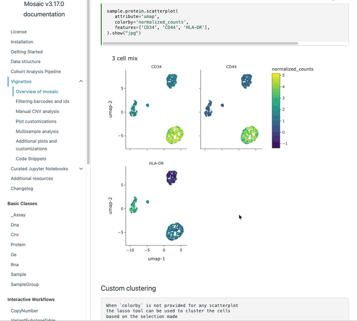

# &nbsp;HoverShot

A native macOS menu-bar screenshot tool that detects on-screen elements and
lets you grab them by hovering. Drag to draw a custom box, hover to snap onto a
detected element, expand the selection into a cluster, and save or copy with a
single key.



**⚠️ Warning:** This project was not manually verified and was entirely created using Claude Code.
    The [python version](https://github.com/KKJSP/hovershot/commit/d2b84a275c8ffbd5b3a3c3023ef1376c3eb1dd63)
    was created and checked for accuracy manually.

## At-a-glance

### Shortcuts (defaults — all remappable in Settings)

| Action               | Default          | Notes                                          |
| -------------------- | ---------------- | ---------------------------------------------- |
| Take screenshot      | <kbd>⌘⇧1</kbd>   | Global; works from any app                     |
| Hover                | mouse            | Highlights the detected element under the cursor |
| Click                | mouse            | Toggles the highlighted box in/out of the selection |
| Drag                 | mouse            | Draws a custom rectangular box freehand        |
| Save selection       | <kbd>S</kbd>     | PNG into the configured save folder            |
| Copy to clipboard    | <kbd>C</kbd>     | PNG onto `NSPasteboard.general`                |
| Open in Preview      | <kbd>V</kbd>     | Saves and opens the file in Preview, then dismisses |
| Toggle flow mode     | <kbd>F</kbd>     | Paint-many: every hovered box joins the selection |
| Toggle auto-cluster  | <kbd>A</kbd>     | Expand the hovered box into its full cluster   |
| Dismiss overlay      | <kbd>Q</kbd>     | Cancels without saving                         |

### Settings (menu bar → **Settings**)

| Option                | What it controls                                                              |
| --------------------- | ----------------------------------------------------------------------------- |
| Keyboard shortcuts    | Per-action chords; duplicate bindings are rejected with an alert              |
| Save folder           | Where saved PNGs land (default `~/Desktop`)                                   |
| Box size (0–100%)     | Morphology kernel size — lower = smaller individual boxes, higher = boxes merge into adjacent elements |
| Selection padding (px)| Pixels added around the selection rect when saving / copying                  |
| Debug mode            | Writes the pipeline's intermediate images into `ScreenshotsDebug/` per shot   |

Settings persist under `~/Library/Preferences/com.hovershot.app.HoverShot.plist`
behind the `hovershot.` key prefix.

## Install

1. Download `HoverShot.app.zip` from the latest GitHub release and unzip it.
2. The download is self-signed, so the first launch needs a Gatekeeper bypass -
   in Finder: right-click the app → **Open** → confirm the dialog.
3. macOS will ask for two permissions on first run:
   * **Accessibility** — needed for the global hotkey monitor.
     *System Settings → Privacy & Security → Accessibility → enable HoverShot.*
   * **Screen Recording** — needed to capture the screen.
     macOS prompts automatically the first time you take a shot.
4. Quit and relaunch HoverShot once after granting permissions.

The prebuilt download is ad-hoc signed. macOS treats every fresh install as a
new app, so if you replace `HoverShot.app` with a newer build the permissions
above must be granted again. Building from source (below) avoids that.

## Build from source

Requirements: macOS 11+, Xcode command-line tools (`xcode-select --install`).

```bash
git clone https://github.com/KKJSP/hovershot.git
cd hovershot
./build.sh
open build/HoverShot.app
```

`build.sh` compiles every `.swift` in `Sources/`, lays out a runnable bundle
under `build/HoverShot.app`, and signs it.

### Signing modes

* **Persistent (default)** — the first build runs `setup-signing.sh`, which
  creates a self-signed code-signing certificate (`hovershot-cert`) in your
  login keychain. Every subsequent rebuild signs with the same identity, so
  macOS's TCC database keeps the Accessibility / Screen Recording grants you
  approved. macOS may prompt for your login password once to mark the cert as
  trusted; nothing leaves your machine.
* **Ad-hoc** — pass `--ad-hoc` to skip the keychain step entirely:

    ```bash
    ./build.sh --ad-hoc
    ```

  The bundle still runs, but each rebuild changes its code-directory hash and
  macOS re-prompts for permissions. Use this for quick one-off builds or for
  producing a release artifact you intend to distribute.

If the keychain step fails for any reason `build.sh` automatically falls back
to ad-hoc signing so you always end up with a runnable bundle.

### Running setup-signing manually

```bash
./setup-signing.sh
```

Idempotent — safe to run more than once. Re-runs only top up trust settings
if the cert is already there.

## Menu bar

* **Take screenshot** — fires the overlay (default global hotkey: ⌘⇧1).
* **Settings…** — about text, shortcut bindings, save folder, box size,
  selection padding, debug toggle.
* **Quit HoverShot**.

Settings are persisted under `~/Library/Preferences/com.hovershot.app.HoverShot.plist`
behind the `hovershot.` key prefix. Default save folder is `~/Desktop`.
